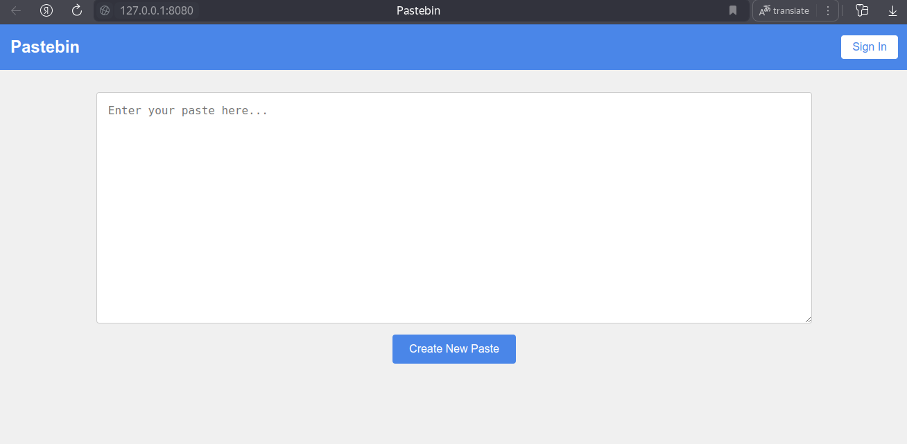
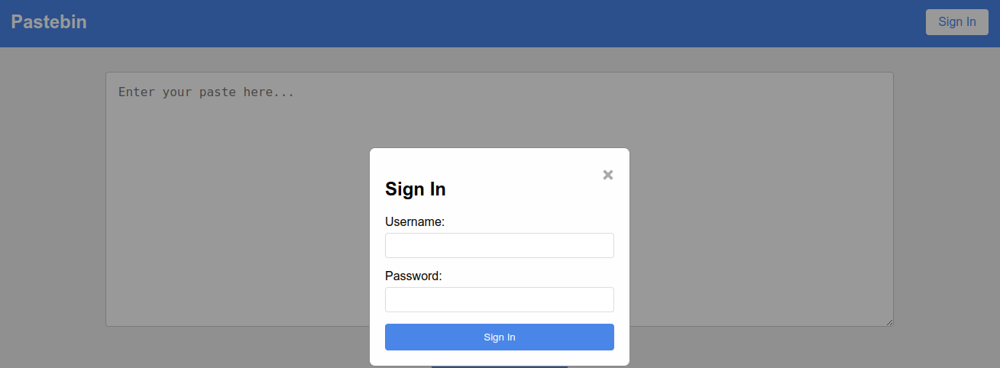
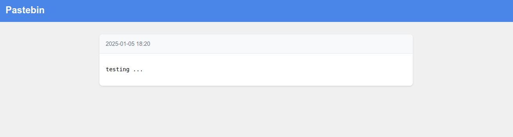
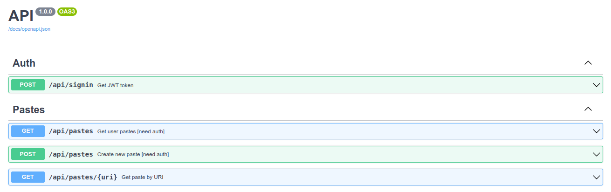

## Запуск приложения при помощи Docker

- **git clone <https://github.com/darialissi/sanic-pastebin.git>**

- **cd sanic-pastebin && docker-compose up**

#
Приложение доступно на <http://127.0.0.1:8080>

Документация **Swagger UI** доступна на <http://127.0.0.1:8000/docs/swagger>
